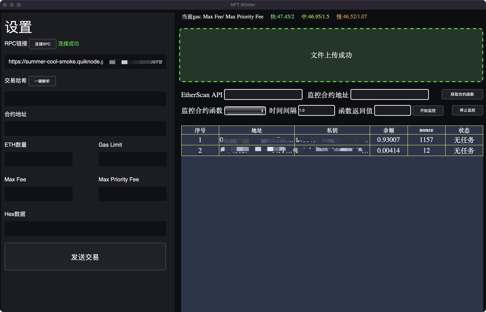

# NFT-Minter

## Usage
This is an app to help you follow transaction from a confirmed transaction hash. Or you can manually set those relevant parameters.

Also, you can use an etherscan API key to fetch ABI of an contract if it is open sourced, as well as to monitor the status of a contract by checking the returned value from the contract.

To use this app, you first need to have a reliable and fast rpc (usually free rpc may limit your rate, you'd better buy a commercial rpc, Quicknode is a good option). Before you doing anything, init the web3 provider by clicking "连接RPC". This app cannot gurantee successful minting, take your own risk!

You can also use pyinstaller or py2app to make it as an portable app. 

Happy minting!

